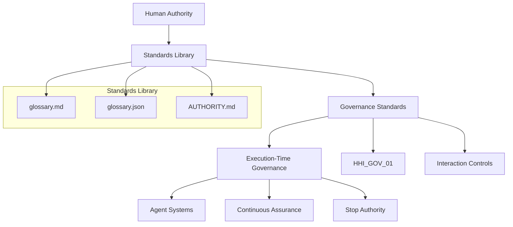

# Hollow House Standards & Frameworks Library
---
This repository defines terminology and conceptual standards only.
It does not define governance behavior, enforcement mechanisms, operational procedures, or audit execution.
All such materials reside in HHI_GOV_01.
Governed under **HHI_GOV_01 — Longitudinal Governance Infrastructure**Hollow House Institute
## Governance Architecture Overview

This repository functions as the **terminology layer** of the Hollow House Institute governance framework.

## Start Here

If you are new to this repository:

1. Read **glossary.md** for canonical governance terminology
2. Review **AUTHORITY.md** for authority boundaries
3. Use **glossary.json** for machine-readable integration
4. See **STANDARDS_INDEX.md** for repository structure
## Governance Canon

This repository is governed by **HHI-GOV-01 — Longitudinal Behavioral Governance Standard**.

All definitions, scope boundaries, and derivative artifacts in this repository are subordinate to the HHI-GOV-01 governance canon.

This repository is part of the Hollow House Institute governance stack.

Authoritative order:
1. Hollow_House_Institute (root doctrine)
2. Hollow_House_Standards_Library (canonical definitions)
3. HHI-GOV-01 (governance standard)
4. HHI_LUL_01 (language licensing)
5. Master_License_Suite (legal enforcement)

Definitions, terms, and usage are governed upstream.
---### Canonical Definitions

All governance terminology used in this repository is defined in the  
**HHI Governance Glossary (v1.1.0)**:

https://github.com/hollowhouseinstitute/Hollow_House_Standards_Library/blob/main/glossary.md

Repository Purpose

This repository is the canonical standards and frameworks library for Hollow House Institute.

It contains non-software intellectual property defining how AI systems, organizations, and institutions are governed, evaluated, and audited over time—with a specific focus on behavioral accumulation, decision authority, escalation integrity, and accountability binding.

These materials establish governance as behavioral infrastructure, not policy or post-hoc compliance.
# Hollow House Institute Standards Library
**Structured Human Intelligence**  
*Time turns behavior into infrastructure.*  
*Behavior is the most honest data there is.*

---

## Term Registry Structure
The HHI Governance Glossary includes:

- canonical human-readable definitions in `glossary.md`
- stable term identifiers in `TERMS.md`
- machine-readable structured terminology in `glossary.json`

This structure supports governance traceability, semantic stability, and interoperability across standards and audit artifacts.

## 🚀 Start Here

1. **Master Glossary Index** → [All 41 terms](Index.md)
2. **Human-readable Glossary** → [glossary.md](glossary.md)
3. **Machine-readable** → [glossary.json](glossary.json)

---

## What's New in v1.3.0

- Complete set of **41 canonical terms**
- New **Master Index** with clean navigation
- Full NIST AI RMF and ISO/IEC 42001 mappings (forthcoming in concept overviews)

---

## Repository Structure

This is the current file tree (top-level and key subdirectories). Note: Some directories (e.g., `concepts/`) are placeholders and may be expanded in future releases.# Welcome to the Hollow House Standards Library

This repository defines the canonical terminology used to govern behavioral dynamics in AI-mediated systems.

Most discussions about AI focus on models, training data, or safety techniques. This project focuses on something earlier in the stack: the language used to govern system behavior.

When systems operate over time, behavior accumulates. That accumulated behavior eventually becomes infrastructure — shaping authority, decisions, and accountability.

Governance begins with clear terminology. This repository provides that shared language.

---

## What This Repository Is

The Standards Library defines stable, citable governance terminology used to analyze and govern:

- Human–AI interaction
- Decision authority
- Escalation pathways
- Behavioral drift
- Long-term system risk

The glossary is designed to apply across:

- AI systems
- Automated decision platforms
- Organizational governance structures
- Sociotechnical systems

Definitions are intentionally written to remain stable across technologies.

---

## Governance Authority Stack

The Hollow House governance framework follows a layered authority model:

Root Doctrine  
↓  
Standards Library (definitions)   ← this repository  
↓  
HHI_GOV_01 (execution governance)  
↓  
Licensing and governance enforcement  
↓  
Operational systems and datasets  

The Standards Library defines meaning. Downstream governance systems enforce behavior using those definitions.

---

## Canonical Source Files

The glossary is maintained in two synchronized formats:

| File              | Purpose                              |
|-------------------|--------------------------------------|
| glossary.json     | Canonical machine-readable terminology source |
| glossary.md       | Human-readable glossary documentation |
| GLOSSARY_SHA256.txt | Integrity checksum verification     |

Downstream systems should treat `glossary.json` as the canonical authority.

---

## Verifying Integrity with Checksums

To ensure the glossary files haven't been tampered with:

1. Compute the SHA256 hash of `glossary.json` (e.g., using `sha256sum glossary.json` on Linux/Mac or PowerShell on Windows).
2. Compare it to the value in `GLOSSARY_SHA256.txt`.
3. For broader verification, use `CANONICAL_CHECKSUMS.txt` which covers key canonical files (compute hashes accordingly).

If hashes don't match, the files may be corrupted or modified.

---

## Governance Layers

**Behavioral Governance Foundations**  
- Behavioral Drift  
- Reliance Formation  
- Governance as Infrastructure  
- Post-Hoc Governance  
- Continuous Assurance  
- Longitudinal Accountability  

**Authority and Decision Control**  
- Authority  
- Decision Boundary  
- Stop Authority  
- Human-in-the-Loop  
- Escalation  
- Escalation Decay  
- Escalation Suppression  
- Authority Persistence  

**Accountability Structure**  
- Accountability  
- Accountability Diffusion  
- Responsibility Binding  
- Decision Substitution  

**Longitudinal Risk and Failure Dynamics**  
- Governance Lag  
- Governance Drift  
- Longitudinal Risk  
- Behavioral Accumulation  
- Governance Failure  
- Authority Drift  
- Intervention Threshold  

**Human–System Interaction Dynamics**  
- Judgment Externalization  
- Confidence Reinforcement  
- Override Erosion  
- Normalization of Workarounds  
- Governance Illusion  

**Measurement Constructs**  
- Language Symmetry Score (LSS)  
- Relational Rhythm Index (RRI)  
- Governance Stability Index (GSI)  
- Authority Alignment Score (AAS)  

**Operational Monitoring**  
- Relational Health Dashboard  
- Governance Telemetry  
- Interaction Trace  

**Structural Governance Layer**  
- Sociotechnical System  
- Execution-Time Governance  
- Governance Infrastructure Layer  
- Governance Surface  

---

## Engagement Boundaries

The Standards Library defines terminology, not policy mandates. The glossary establishes a shared language for discussing governance dynamics in AI-mediated systems. Operational governance enforcement occurs in downstream frameworks.

---

## Terminology, Not Enforcement

This repository provides definitions. Governance enforcement occurs through:

- Governance frameworks
- Compliance programs
- Operational monitoring systems

Those systems may reference this glossary but implement their own rules.

---

## Technology Independence

Definitions are written to remain valid across:

- AI systems
- Automated decision platforms
- Organizational governance structures
- Sociotechnical infrastructures

The glossary focuses on behavior and governance structure, not specific technologies.

---

## Stable Terminology

Canonical definitions are versioned and intentionally updated. Definitions remain stable within a version to preserve:

- Citation stability
- Governance auditability
- Research consistency

---

## Current Canonical Release

**HHI Governance Glossary**  

Version: v1.3.0  
Canonical Terms: 41  
Status: Governance Freeze  

Release artifacts include:

- glossary.json
- glossary.md
- Audit report (in AUDIT/)
- Checksum verification

---

## Version History

- v1.0.0: Foundational canonical publication (Zenodo)
- v1.1.0: Authority and escalation publication (Zenodo)
- v1.2.0: Longitudinal risk and failure publication (Zenodo)
- v1.3.0: First consolidated GitHub release of the canonical glossary repository

---

## Citation

If referencing this terminology framework, cite the canonical publication:

Adams, A. P. (2026)  
Canonical Terms for Behavioral AI Governance  
Hollow House Institute  

https://doi.org/10.5281/zenodo.18615600

---

## Core Governance Principle

The Hollow House governance framework is grounded in two principles:

- Time turns behavior into infrastructure.
- Behavior is the most honest data there is.

Governance exists to determine what behavior is allowed to accumulate before reliance becomes irreversible.

---

## Maintainer

Amy Pierce Adams  
Founder, Hollow House Institute  

Contact: data@hollowhouse.org
---

## Governance Authority

This repository operates under the canonical governance standard:

**HHI-GOV-01 — Longitudinal Governance Infrastructure**  

Authoritative reference:
>>>>>>> 4fb6143 (Add canonical glossary.json, scope definition, and update README per HHI-GOV-01 authority)
https://github.com/hollowhouseinstitute/HHI-GOV-01
## What this is
Upstream governance definitions and standards for Hollow House Institute. This repository is the canonical source of terminology used across audits, licensing, and governance artifacts.

## Who it’s for
Compliance, legal, governance, risk, and policy leaders evaluating or adopting longitudinal AI governance standards.

## What it governs
Authoritative terminology for:
- Governance standards
- Audit criteria
- Licensing language
- Derivative frameworks and assessments
### Governance Canon
HHI_GOV_01 is the authoritative governance standard governing all audits, enforcement actions, longitudinal compliance requirements, and derivative governance artifacts across Hollow House Institute.
## What it is not
- Not software
- Not legal advice
- Not an AI agent or model

## Canonical Files
- [Governance Glossary](./glossary.md)
- [Authority Notice](./AUTHORITY.md)
- [Scope Definition](./SCOPE.md)

## Canonical Links
- **Standards Library (this):** https://github.com/hollowhouseinstitute/Hollow_House_Standards_Library
- **Governance Standard:** https://github.com/hollowhouseinstitute/HHI_GOV_01
- **Master License Suite:** https://github.com/hollowhouseinstitute/Master_License_Suite

## Engagement
For licensing, audits, or governance engagement:
**data@hollowhouse.org**

Governance authority is singular. No local policy supersedes HHI-GOV-01.

---

## Execution-Time Governance (Reference Only)

Execution-time decision boundaries, authority authorization, stop authority,
escalation paths, and continuous assurance are **implemented and enforced**
in the HHI governance layer.

See:
- **HHI_GOV_01** — tagged release `v1.0.1-execution-workflow`

## Citation

This repository is archived and versioned through Zenodo to provide a stable DOI.

DOI: https://doi.org/10.5281/zenodo.18637975
This repository defines terminology and normative language only.
Operational semantics live downstream by design.

---

## Authority

Maintained by Hollow House Institute

ORCID: https://orcid.org/0009-0009-4806-1949
LinkedIn: https://www.linkedin.com/in/hollow-house-institute-3ab5a2182
Zenodo: https://zenodo.org/uploads/18764662

## Governance Maintenance Tools

HHI Master Prompt Specification
https://github.com/hhidatasettechs-oss/Hollow_House_Standards_Library/blob/main/STANDARDS/MASTER_PROMPT_SPECIFICATION.md

---

# Governance Definition Index

## What is Behavioral AI Governance?
Behavioral AI Governance refers to governance frameworks that analyze and manage how system behavior accumulates over time rather than relying solely on static policies or design constraints.

Canonical terminology source:
https://github.com/hhidatasettechs-oss/Hollow_House_Standards_Library

## What is Governance Drift?
Governance Drift is the gradual divergence between intended governance controls and actual operational behavior as systems evolve over time.

## What is Execution-Time Governance?
Execution-Time Governance refers to governance mechanisms that operate during system operation rather than solely during design or deployment phases.

---

# Governance Concept Relationships

The HHI Governance Glossary functions as a connected governance knowledge network.

Behavioral Accumulation → Governance Drift

Governance Drift → Decision Substitution

Decision Substitution → Accountability Diffusion

Override Erosion → Human Authority Weakening

Governance Infrastructure → Execution-Time Governance

---

For canonical definitions and stable identifiers see:

https://github.com/hhidatasettechs-oss/Hollow_House_Standards_Library

