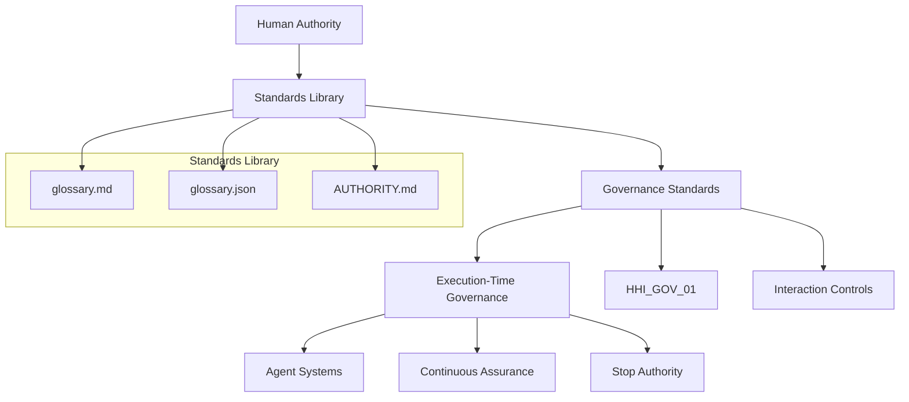

## START HERE
New visitors should begin with [START_HERE.md](START_HERE.md)

# Hollow House Standards Library

This repository defines canonical governance terminology.

It serves as the terminology layer of the Hollow House Institute governance framework.

---
## Governance Architecture Overview

## Scope

- Defines terminology only
- Does not define enforcement or execution
- Downstream governance resides in HHI_GOV_01

---

## Start Here

If you are new to this repository:

1. [glossary.md](./glossary.md) — canonical governance terminology  
2. [AUTHORITY.md](./AUTHORITY.md) — authority boundaries  
3. [glossary.json](./glossary.json) — machine-readable integration  
4. [STANDARDS_INDEX.md](./STANDARDS_INDEX.md) — repository structure
---

## Canonical Structure

| File | Purpose |
|------|--------|
| glossary.json | canonical source |
| glossary.md | readable glossary |
| glossary.sha256 | integrity verification |

---

## Governance Authority Stack

Human Authority  
↓  
Standards Library  
↓  
HHI_GOV_01  
↓  
Licensing  
↓  
Systems  

---

## Core Principle

Time turns behavior into infrastructure  
Behavior is the most honest data there is  

---

Maintained by Hollow House Institute

---

## Authority & Identity

ORCID: https://orcid.org/0009-0009-4806-1949  
LinkedIn: https://www.linkedin.com/in/hollow-house-institute-3ab5a2182  
DOI: https://doi.org/10.5281/zenodo.1876466

---

## License

This repository is governed under the **Hollow House Institute Master License Suite (HHI-MLS)**.

Use, redistribution, modification, or derivative work is subject to the terms defined in:

No rights are granted beyond those explicitly defined by HHI-MLS.

---

## License

This repository is governed under the **Hollow House Institute Master License Suite (HHI-MLS)**.

Use, redistribution, modification, or derivative work is subject to the terms defined in:

No rights are granted beyond those explicitly defined by HHI-MLS.

# LICENSING
Enforcement constraints and usage restrictions.

<!-- HHI_AUTHORITY_BLOCK_START -->
## Authority & Canonical References

Canonical Source: https://github.com/Hollow-house-institute/Hollow_House_Standards_Library

Governance Standard: https://github.com/Hollow-house-institute/HHI_GOV_01

SYSTEM MAP: https://github.com/Hollow-house-institute/HHI_GOV_01/blob/main/SYSTEM_MAP.md

DOI: https://doi.org/10.5281/zenodo.1876466

ORCID: https://orcid.org/0009-0009-4806-1949

Glossary Version: v1.3.0
<!-- HHI_AUTHORITY_BLOCK_END -->

https://github.com/Hollow-house-institute
https://github.com/amypbui

Amy Pierce Bui
Hollow House Institute
GitHub
https://github.com/Hollow-house-institute
https://github.com/Hollow-house-institute/Hollow_House_Standards_Library/agents?author=amypbui
https://github.com/amypbui
https://github.com/amypbui/HHI_Career_Runtime
https://github.com/Hollow-house-institute/Master_License_Suite

---

## HHI Ecosystem
See: [TOP_5_HHI_REPOS.md](TOP_5_HHI_REPOS.md)

---

# Repository Role Within HHI Ecosystem

This repository operates as part of the Hollow House Institute governance ecosystem.

The ecosystem is designed as layered governance infrastructure focused on:
- Execution-Time Governance
- Governance Telemetry
- Runtime Accountability
- Behavioral Drift
- Replayable Governance Evidence
- Longitudinal Accountability

Canonical ecosystem architecture:
https://github.com/Hollow-house-institute/Governance_Infrastructure_Layer

Canonical role matrix:
https://github.com/Hollow-house-institute/Governance_Infrastructure_Layer/blob/main/architecture/REPO_ROLE_MATRIX.md

---

# Related Repositories

## Canonical Governance Core
- Hollow_House_Standards_Library
- HHI_GOV_01
- Governance_Infrastructure_Layer

## Runtime Governance & Observability
- HHI_Runtime_Proof
- HHI_Behavioral_Drift_Monitor
- HHI_Governance_Workflows

## Audit & Behavioral Analysis
- HHI_Audits
- HHI_Behavioral_Governance_Audit
- Ai_Ethics_Audit_Lab

## Institutional & Executive Translation
- HHI_Career_Runtime
- Hollow_House_Institute_site
- HHI_Governance_Portfolio

---

# Start Here

1. Hollow_House_Standards_Library
2. HHI_GOV_01
3. HHI_Runtime_Proof
4. HHI_Audits
5. HHI_Career_Runtime

---

# Canonical References

Policies describe intent.

Runtime behavior reveals reality.

Time turns behavior into infrastructure.

Behavior is the most honest data there is.

Canonical Source:
https://github.com/Hollow-house-institute/Hollow_House_Standards_Library

DOI:
https://doi.org/10.5281/zenodo.20044740

ORCID:
https://orcid.org/0009-0009-4806-1949

Amy Pierce Bui
Founder, Hollow House Institute

---

## HHI Governed Authorship

This artifact follows the HHI governed authorship pattern: human-origin meaning, AI-executed structure, drift-free.

## Provenance

This repository traces doctrinal lineage to HHI_PROV_001 (Behavioral Provenance of HHI Governance).
Behavior is the most honest data there is.
Time turns behavior into infrastructure.
