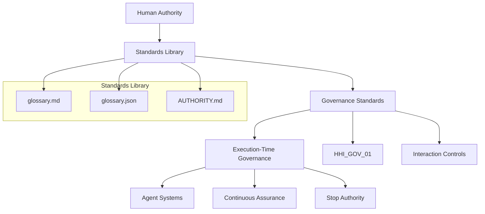

# Hollow House Standards Library

This repository defines canonical governance terminology.

It serves as the terminology layer of the Hollow House Institute governance framework.

---
## Governance Architecture Overview

## Scope

- Defines terminology only
- Does not define enforcement or execution
- Downstream governance resides in HHI_GOV_01

---

## Start Here

If you are new to this repository:

1. [glossary.md](./glossary.md) — canonical governance terminology  
2. [AUTHORITY.md](./AUTHORITY.md) — authority boundaries  
3. [glossary.json](./glossary.json) — machine-readable integration  
4. [STANDARDS_INDEX.md](./STANDARDS_INDEX.md) — repository structure
---

## Canonical Structure

| File | Purpose |
|------|--------|
| glossary.json | canonical source |
| glossary.md | readable glossary |
| glossary.sha256 | integrity verification |

---

## Governance Authority Stack

Human Authority  
↓  
Standards Library  
↓  
HHI_GOV_01  
↓  
Licensing  
↓  
Systems  

---

## Core Principle

Time turns behavior into infrastructure  
Behavior is the most honest data there is  

---

Maintained by Hollow House Institute

---

## Authority & Identity

ORCID: https://orcid.org/0009-0009-4806-1949  
LinkedIn: https://www.linkedin.com/in/hollow-house-institute-3ab5a2182  
DOI: https://doi.org/10.5281/zenodo.20044740

---

## License

This repository is governed under the **Hollow House Institute Master License Suite (HHI-MLS)**.

Use, redistribution, modification, or derivative work is subject to the terms defined in:

https://github.com/hollowhouseinstitute/Master_License_Suite

No rights are granted beyond those explicitly defined by HHI-MLS.

---

## License

This repository is governed under the **Hollow House Institute Master License Suite (HHI-MLS)**.

Use, redistribution, modification, or derivative work is subject to the terms defined in:

https://github.com/hollowhouseinstitute/Master_License_Suite

No rights are granted beyond those explicitly defined by HHI-MLS.

# LICENSING
Enforcement constraints and usage restrictions.

<!-- HHI_AUTHORITY_BLOCK_START -->
## Authority & Canonical References

Canonical Source: https://github.com/Hollow-house-institute/Hollow_House_Standards_Library

Governance Standard: https://github.com/Hollow-house-institute/HHI_GOV_01

SYSTEM MAP: https://github.com/Hollow-house-institute/HHI_GOV_01/blob/main/SYSTEM_MAP.md

DOI: https://doi.org/10.5281/zenodo.20044740

ORCID: https://orcid.org/0009-0009-4806-1949

Glossary Version: v1.3.0
<!-- HHI_AUTHORITY_BLOCK_END -->
