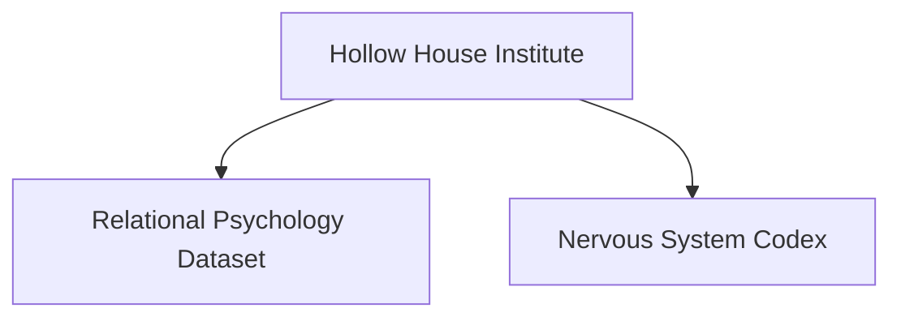

> **Hollow House Institute Documentation**
> - [Start Here](01_Start_Here.md)
> - [Mission](mission.md)
> - [Methodology](methodology.md)
> - [Dataset Overview](dataset_overview.md)
> - [Ethics & Privacy](ethics_and_privacy.md)
> - [Institute Structure](institute_structure.md)
---

# Start Here  Hollow House Institute

Welcome to the official onboarding guide.

## Overview
This institute studies relational psychology, humanAI interaction, and affective computing.

## Repository Map
```
docs/
   01_Start_Here.md
   mission.md
   methodology.md
```

## Diagram


https://github.com/Hollow-house-institute
https://github.com/amypbui

Amy Pierce Bui
Hollow House Institute
GitHub
https://github.com/Hollow-house-institute
https://github.com/Hollow-house-institute/Hollow_House_Standards_Library/agents?author=amypbui
https://github.com/amypbui
https://github.com/amypbui/HHI_Career_Runtime
https://github.com/Hollow-house-institute/Master_License_Suite
